# UX Design Specification - portoflio-upgrade

**Author:** Baptiste
**Date:** 2026-01-15

---

## Executive Summary

### Project Vision

portoflio-upgrade est un portfolio "Experience MVP" où le portfolio lui-même devient la démonstration de l'expertise senior de Baptiste en Product Design. L'objectif n'est pas uniquement de présenter des projets, mais de prouver la maîtrise technique et UX par l'exécution du portfolio.

**Objectif Business Critique :** Atteindre 20% de taux de conversion candidature → entretien pour décrocher un poste Founder Designer ou Solo Designer dans une startup B2B SaaS Série A/B (2-3x la baseline standard de 5-10%).

**Philosophie UX :** "Show, don't tell" - Le portfolio comme produit tech vivant qui démontre par l'expérience elle-même la capacité à livrer des produits pixel perfect avec process rigoureux.

### Target Users

**Persona 1 : Denis (32 ans) - Le Recruteur en Mode Batch Screening**
- Contexte : Sessions batch de screening, 5-10 portfolios d'affilée, entre deux meetings
- Besoin critique : Scanner keywords rapidement ("B2B SaaS", "Design System", "6 ans d'expérience")
- Temps disponible : 10-25 secondes pour décision shortlist ou next
- Décision : Passe au suivant ou transfère à Mathilde pour validation technique

**Persona 2 : Mathilde (29 ans) - La Lead Designer Sceptique**
- Contexte : 15-20 minutes entre deux meetings ou avant pause midi, analyse technique approfondie
- Besoin critique : Valider process design visible, détecter red flags ("Dribbble syndrome")
- Temps disponible : 2-5 minutes, lecture 1-2 case studies max
- Décision : Valide techniquement ou rejette si manque de substance

**Persona 3 : Thomas (38 ans) - Le CEO qui Se Projette**
- Contexte : Moment calme avec du temps libre, ou juste avant l'entretien (préparation/vérification)
- Besoin critique : Projection factuelle "Peut-il faire ça chez nous aussi ?"
- Temps disponible : 5-8 minutes, lecture approfondie avec focus métriques business
- Décision : Conviction contact immédiat ou doute

### Key Design Challenges

**Challenge 1 : Capter l'Attention en 0-10s (Moment Critique Priority #1)**

Denis fait du batch screening et passe 5-10 portfolios d'affilée. Défi UX : Hero section instantanément scannable avec keywords visibles en < 3 secondes, animation spectaculaire qui ne masque pas l'info critique, performance < 1.5s FCP non-négociable.

**Challenge 2 : Révéler le Process en 2-5min (Moment Critique Priority #2)**

Mathilde a 15-20 minutes entre meetings et lira 1-2 case studies max. Défi UX : Case studies scannables ET approfondissables, panel contextuel enrichissant sans alourdir, wireframes/iterations/rationale visuellement évidents, structure narrative forte avec signaux visuels clairs.

**Challenge 3 : Desktop-First avec Mobile Intentionnel (Pas Responsive Classique)**

Majoritairement desktop (80%+), mobile doit rester consultable avec layout complètement différent. Défi UX : Tri-panel desktop optimal (20% Nav / 50% Content / 30% Context), mobile 1 col stack avec features complexes désactivées si nécessaire, tablet comme zone grise à définir (2 cols simplifié ou mobile-like).

**Challenge 4 : Différenciation dans Océan de Portfolios Clones**

Frustration utilisateurs = portfolios tous pareils, pas de personnalité, pas de process visible. Défi UX : Command Palette Cmd+K comme signature feature, panel contextuel adaptatif unique, animations/micro-interactions comme craft visible, portfolio comme produit tech vivant pas galerie statique.

### Design Opportunities

**Opportunity 1 : Panel Contextuel comme Narrative Layer**

Le panel contextuel qui change selon section consultée (Problem → Contraintes, Solution → Alternatives, Results → Métriques) devient killer UX feature. Storytelling à deux niveaux : contenu principal = output, panel = process/contexte invisible qui enrichit.

**Opportunity 2 : Desktop Experience Premium**

Desktop-first permet d'aller à fond sur expérience desktop sans compromis mobile-first : Tri-panel avec navigation spatiale vraie, keyboard shortcuts avancés (Cmd+K, Cmd+1/2/3), hover states riches et narratifs, animations scroll parallax calibrées trackpad/souris.

**Opportunity 3 : First 10 Seconds comme Masterclass**

Moment 0-10s critique pour Denis devient démonstration de maîtrise : Splash screen < 1.5s = preuve technique immédiate, typographie monumentale + keywords cascade = impact visuel + contenu scannable, transition splash → dashboard 60fps = craft visible, effet "ce designer sait ce qu'il fait" établi en 10 secondes.

---

## Core User Experience

### Defining Experience

portoflio-upgrade repose sur une double expérience critique non-négociable :

**1. Scan Ultra-Rapide (0-10s) - Filtre Denis**

Keywords visibles instantanément (< 3s), hero section scannable même avec animation spectaculaire, performance < 1.5s FCP pour effet "wow technique immédiat". C'est le make-or-break : si Denis rate les keywords → poubelle.

**2. Lecture Approfondie Process (2-5min) - Validation Mathilde**

Case studies scannables ET approfondissables simultanément, panel contextuel facile à comprendre (zero question à se poser), process design visible avec wireframes/iterations/rationale.

**Principe Cœur :** Ces deux expériences doivent coexister sans compromis. Le scan rapide ne doit pas nuire à la profondeur, et vice-versa.

### Platform Strategy

**Desktop-First Premium (80%+ trafic)**

Layout Tri-Panel :
- Nav Gauche (20%) : Fixe, navigation spatiale permanente
- Contenu Central (50%) : Scrollable, contenu principal case studies
- Panel Contextuel Droit (30%) : Fixe, synchronisé avec scroll du contenu

Interactions Premium :
- Command Palette Cmd+K : Signature feature desktop (navigation rapide power users)
- Hover Effects Fluides : Tooltips intelligents, feedback immédiat (gestion via presets GSAP)
- Scroll Parallax Léger : Subtil, calibré trackpad/souris (presets GSAP ajustés)
- Keyboard Shortcuts : Cmd+K suffit

Approche Technique : Animations gérées avec presets GSAP qu'on ajustera au besoin (pas custom from scratch), performance 60fps garantie via presets optimisés.

**Mobile Intentionnel (20% trafic)**

Layout 1 Col Stack : Navigation drawer hamburger, contenu 100% largeur scrollable, panel contextuel rétractable/ouvrable avec bouton OU slide vers la droite.

Simplifications Acceptables :
- Command Palette → Remplacé par menus supplémentaires classiques
- Panel Contextuel → Optionnel, caché par défaut (bouton pour ouvrir)
- Scroll Parallax → À évaluer, possiblement désactivé
- Hover Effects → Convertis en long press OU affichage différent permanent

Philosophie Mobile : Consultable et fonctionnel, mais pas d'équivalence desktop. OK pour perdre features complexes.

### Effortless Interactions

**Navigation Fluide (Priorité #1)**

Transitions entre pages < 300ms, 60fps garanti. Tri-panel desktop : colonnes fixes, seul contenu central scroll. Command Palette : Cmd+K → ouverture instantanée, recherche fuzzy immédiate. Breadcrumbs toujours visibles pour orientation.

**Compréhension Panel Contextuel (Priorité #2)**

Changement de contenu synchronisé avec scroll sans effort utilisateur. Aucune action requise pour voir contexte pertinent (automatique). Hiérarchie visuelle claire : titre section + contenu contextuel immédiatement scannable. Desktop toujours visible, mobile optionnel mais clair.

**Scan Keywords Immédiat (Priorité #3)**

Hero section : typographie monumentale + keywords en < 3s (même avec animation). Tags projets : visuels, cliquables, immédiatement identifiables. Performance < 1.5s FCP = preuve technique immédiate.

### Critical Success Moments

**Moment 1 : Denis Scanne (0-10s) - MAKE OR BREAK**

Succès : Keywords "B2B SaaS • Design System • 6 ans" visibles en < 3s → Shortlist. Échec : Keywords masqués par animation ou invisibles → Poubelle. UX Critique : Animation spectaculaire qui NE MASQUE PAS l'info critique.

**Moment 2 : Mathilde Valide Process (2-5min)**

Succès : Wireframes/iterations visibles, panel contextuel enrichit la lecture → "Il pense produit". Échec : Juste screenshots sans contexte → Red flag "Dribbble syndrome". UX Critique : Structure narrative claire (Context → Research → Process → Solution → Results).

**Moment 3 : Thomas Se Projette (5-8min)**

Succès : Métriques business (-35% temps) + ressources (4 mois, 1 designer) → "Il peut faire ça chez nous". Échec : Pas de métriques factuelles → Pas de projection. UX Critique : Panel contextuel Results affiche timeline/ressources/learnings.

**Moment 4 : Découverte Command Palette (Power Users)**

Succès : Hint "⌘K" visible header → Découverte feature → "Ce portfolio est un vrai produit tech". Échec : Feature cachée jamais découverte → Opportunité "wow" manquée. UX Critique : Discoverability via hint subtil (disparaît après première utilisation).

### Experience Principles

**Principe 1 : "Instant Scan, Infinite Depth"**

Tout doit être scannable en 10s (Denis) ET approfondi en 5min (Mathilde) sans compromis. Layout tri-panel permet scan rapide (titres, keywords, tags) avec profondeur optionnelle (panel contextuel, process détaillé).

**Principe 2 : "Zero Cognitive Load Navigation"**

Navigation doit être invisible et instinctive. Colonnes fixes desktop (seul contenu scroll), Command Palette Cmd+K pour shortcuts, breadcrumbs orientation, transitions fluides < 300ms. Utilisateur ne se pose jamais la question "comment j'arrive là ?".

**Principe 3 : "Desktop Premium, Mobile Intentionnel"**

Optimiser à fond desktop (80% trafic) sans compromis mobile-first. Tri-panel fixe, hover effects riches, scroll parallax, keyboard shortcuts. Mobile = layout différent 1 col stack avec simplifications acceptables (Command Palette → menus, panel contextuel optionnel).

**Principe 4 : "Performance = Craft Visible"**

Performance < 1.5s FCP + animations 60fps = preuve technique immédiate. Splash screen charge instantanément, transitions fluides, scroll parallax sans jank. Portfolio démontre maîtrise par l'exécution elle-même. Animations via presets GSAP ajustés (pas custom from scratch).

**Principe 5 : "Context Enriches, Never Overloads"**

Panel contextuel enrichit lecture sans alourdir. Change automatiquement selon section (Problem → Contraintes, Solution → Alternatives, Results → Métriques). Desktop toujours visible, mobile optionnel. Storytelling à deux niveaux : contenu principal = output, panel = process invisible.

---

## Desired Emotional Response

### Primary Emotional Goals

**Denis (0-10s - Scan Rapide) : Confiance Immédiate + Sensation de Maîtrise**

"Celui-là a l'air solide, on a la sensation qu'il maîtrise." L'objectif émotionnel est de transformer instantanément l'état "fatigué, prochain par défaut" en "intéressé puis confiant". L'émotion clé est la confiance technique immédiate visible par l'exécution elle-même.

**Mathilde (2-5min - Validation Technique) : Connexion Peer-to-Peer + Respect Professionnel**

Mixte de reconnaissance professionnelle ("Lui, il sait ce qu'il fait") et de connexion entre pairs ("Je peux travailler avec quelqu'un comme ça"). L'objectif est de transformer le scepticisme initial (œil critique activé) en curiosité pendant la lecture, puis en enthousiasme au moment de la validation.

**Thomas (5-8min - Projection) : Excitation Opportunité + Fit avec Besoins**

"Oh c'est stylé ce qu'il fait, ça pourrait matcher avec ce qu'on cherche!" L'objectif émotionnel est de transformer l'espoir prudent (déjà 2 designers ratés) en intrigue avec projection, puis en sentiment rassuré qui réfléchit au futur. Émotion clé : l'opportunité à ne pas laisser passer.

### Emotional Journey Mapping

**Denis - Du Batch Screening à la Shortlist**

1. **Arrivée (État initial)** : Fatigué, en mode "prochain par défaut"
   - Context : 5-10 portfolios d'affilée, sessions batch entre meetings
   - Émotion baseline : Fatigue décisionnelle, défensif

2. **Après Scan Keywords (0-3s)** : Intéressé
   - Trigger : Keywords "B2B SaaS • Design System • 6 ans" visibles < 3s
   - Transition émotionnelle : Fatigue → Curiosité piquée

3. **Décision Shortlist (10s)** : Confiant
   - Trigger : Animation spectaculaire 60fps + performance < 1.5s = craft visible
   - Émotion finale : "Celui-là a l'air solide, je transfère à Mathilde"

**Mathilde - De la Scepticisme à l'Enthousiasme**

1. **Arrivée (État initial)** : Sceptique, œil critique activé
   - Context : 15-20min entre meetings, analyse technique approfondie
   - Émotion baseline : Défensive, prête à détecter "Dribbble syndrome"

2. **Pendant Lecture Case Study (2-5min)** : Curieux
   - Trigger : Wireframes/iterations visibles, panel contextuel enrichissant
   - Transition émotionnelle : Scepticisme → Intrigue ("Il pense produit")

3. **Moment Validation (5min)** : Enthousiaste
   - Trigger : Process design visible avec structure narrative claire
   - Émotion finale : "Connexion peer-to-peer + Respect pro" → Validation OK

**Thomas - De la Prudence à la Projection**

1. **Arrivée (État initial)** : Espoir + prudent (déjà 2 designers ratés)
   - Context : Moment calme avec temps libre, lecture approfondie
   - Émotion baseline : Optimisme mesuré, besoin de preuves factuelles

2. **Pendant Lecture Métriques (5-8min)** : Intrigué et en projection
   - Trigger : Métriques business (-35% temps) + ressources (4 mois, 1 designer)
   - Transition émotionnelle : Prudence → "Il peut faire ça chez nous aussi"

3. **Moment Projection (8min)** : Rassuré et réfléchit au futur
   - Trigger : Panel contextuel Results avec timeline/ressources/learnings
   - Émotion finale : Conviction + Urgence → Contact immédiat

### Micro-Emotions

**Premier Scan (0-10s) - Moment Make-or-Break**

Micro-émotions prioritaires :
- **Curiosité** : "Intéressant, je veux en voir plus"
- **Effet "Impressionné"** : "Wow, ce designer sait ce qu'il fait"

Triggers UX :
- Performance < 1.5s FCP = preuve technique immédiate
- Typographie monumentale + keywords cascade = impact visuel + scannable
- Transition splash → dashboard 60fps = craft visible

Micro-émotions à éviter :
- Confusion (keywords masqués par animation)
- Impatience (chargement > 3s)

**Première Lecture (2-5min) - Validation Process**

Micro-émotions prioritaires :
- **Intrigué** : "Il y a de la profondeur ici"
- **Intéressé** : "Je veux comprendre son process"

Triggers UX :
- Panel contextuel qui change automatiquement (storytelling à deux niveaux)
- Wireframes/iterations visibles (process transparent)
- Structure narrative claire (Context → Research → Process → Solution → Results)

Micro-émotions à éviter :
- Scepticisme maintenu (pas de process visible = Dribbble syndrome)
- Ennui (trop de texte sans visuels)

**Décision Finale (5-8min) - Projection & Contact**

Micro-émotions prioritaires :
- **Confiant** : "Je peux lui faire confiance pour notre projet"
- **Urgence** : "Je ne veux pas le perdre, agissons"

Triggers UX :
- Métriques business factuelles (chiffres précis, impact mesurable)
- Ressources/timeline réalistes (projection facilitée)
- Call-to-action clair et accessible

Micro-émotions à éviter :
- Doute (pas de métriques = pas de projection)
- Hésitation (contact difficile à trouver)

### Design Implications

**Pour Denis - Confiance Immédiate (0-10s)**

Si l'émotion désirée est "Celui-là a l'air solide", les choix UX doivent signaler compétence technique instantanément :
- Performance < 1.5s FCP = preuve immédiate "il sait optimiser"
- Animation spectaculaire 60fps = craft visible sans effort
- Keywords visibles < 3s même avec animation = rigueur + impact
- Typographie monumentale = confiance professionnelle

**Pour Mathilde - Connexion Peer-to-Peer (2-5min)**

Si l'émotion désirée est "connexion professionnelle + respect", les choix UX doivent révéler le process :
- Wireframes/iterations visibles = transparence process
- Panel contextuel enrichissant = storytelling à deux niveaux (output + process)
- Structure narrative claire = rigueur de pensée
- Alternatives/contraintes exposées = honnêteté intellectuelle

**Pour Thomas - Projection Facilitée (5-8min)**

Si l'émotion désirée est "opportunité + fit avec besoins", les choix UX doivent faciliter projection :
- Métriques business factuelles (-35% temps) = impact mesurable
- Ressources/timeline exposées (4 mois, 1 designer) = réalisme
- Learnings/retrospective = maturité professionnelle
- Call-to-action clair = passage à l'action facile

**Éviter les Émotions Négatives (Red Flags)**

Interactions qui créent confusion, scepticisme, ou doute doivent être éliminées :
- Animation qui masque keywords → Confusion → Poubelle
- Screenshots sans contexte → Scepticisme → Red flag "Dribbble"
- Absence de métriques → Doute → Pas de contact
- Chargement lent → Impatience → "Il ne sait pas optimiser"

### Emotional Design Principles

**Principe 1 : "First Impression = Lasting Impression"**

Les 3 premières secondes établissent la crédibilité technique. Performance < 1.5s + animation 60fps + keywords visibles instantanément = signal "ce designer maîtrise son craft". Denis décide en 10s : l'impact immédiat est non-négociable.

**Principe 2 : "Process Visibility Builds Trust"**

Montrer le process (wireframes, iterations, alternatives, contraintes) crée connexion peer-to-peer avec Mathilde. Transparence = respect professionnel. Panel contextuel révèle le "comment" invisible qui transforme scepticisme en enthousiasme.

**Principe 3 : "Metrics Drive Confidence & Projection"**

Chiffres factuels (-35% temps, 4 mois, 1 designer) rassurent Thomas et facilitent projection "Il peut faire ça chez nous aussi". Métriques business = langage CEO, tangible, projectable.

**Principe 4 : "Performance = Craft Signal"**

Fluidité technique (transitions < 300ms, scroll 60fps, parallax sans jank) impressionne immédiatement. Portfolio = produit tech vivant qui démontre compétence par l'exécution. "Show, don't tell" via performance.

**Principe 5 : "Context Creates Sustained Intrigue"**

Panel contextuel adaptatif maintient curiosité et enrichit lecture sans alourdir. Storytelling à deux niveaux (contenu principal = output, panel = process invisible) crée profondeur qui transforme "intéressé" en "enthousiaste".

---

## UX Pattern Analysis & Inspiration

### Inspiring Products Analysis

**Linear, Dia, Arc - Onboarding Full Screen Animés**

Ce que ces produits réussissent exceptionnellement :
- **Storytelling progressif** : Une idée par écran, pas tout d'un coup (cognitive load maîtrisé)
- **Animation fluide entre slides** : Transitions spectaculaires 60fps sans jank
- **Typographie monumentale** : Capte l'attention, hiérarchie claire immédiate
- **Performance/Fluidité** : Aucune hésitation, sentiment premium instantané
- **Courbes de vitesse maîtrisées** : Ease-out lent (~1.2s) qui donne l'info au bon moment

**Application Portfolio** : Splash screen d'entrée en 2 slides avec storytelling qui amène vers dashboard. Slide 1 place keywords critiques, Slide 2 approfondit + photo éventuelle, transition vers tri-panel dashboard.

**Stripe, Algolia - Maîtrise UI Premium**

Excellence visuelle via détails précis :
- **Typographie impeccable** : Hiérarchie claire, lisibilité parfaite, choix de fonts réfléchis
- **Spacing/Layout précis** : Tout respire, alignement pixel-perfect, grid system rigoureux
- **Couleurs subtiles et cohérentes** : Palette restreinte utilisée intelligemment, pas de surcharge
- **Animations micro-interactions** : Hover effects fluides, transitions états, feedback immédiat
- **Cohérence Dark Mode** : Implémentation soignée, contraste maintenu

**Application Portfolio** : Pousser à fond typographie monumentale, spacing généreux, palette restreinte (2-3 couleurs max), animations GSAP presets ajustés pour micro-interactions.

### Transferable UX Patterns

**Pattern Navigation : Splash Screen Storytelling Multi-Slides**

- **Source** : Linear/Dia/Arc onboarding
- **Adaptation Portfolio** : 2 slides avec boutons "Suivant" explicites
  - Slide 1 : Petit texte + keywords critiques ("B2B SaaS • Design System • 6 ans")
  - Slide 2 : Second texte + photo potentielle
  - Transition finale → Tri-panel dashboard
- **Timing** : Ease-out lent (~1.2s) pour effet premium sans rush
- **Rationale** : Storytelling progressif place keywords rapidement (< 3s slide 1) tout en permettant impression spectaculaire

**Pattern Interaction : Command Palette Multi-Fonctions**

- **Source** : Vercel/GitHub/Raycast command palettes
- **Adaptation Portfolio** : Cmd+K ouvre barre de recherche avec commandes slash
  - Navigation rapide vers projets/sections
  - Toggle dark mode via `/dark` command
  - Extensible pour autres features (filtres, raccourcis)
- **Rationale** : Signature feature desktop, power users découvrent progressivement, différenciation vs portfolios classiques

**Pattern Visuel : Typographie Monumentale + Spacing Généreux**

- **Source** : Stripe/Algolia maîtrise UI
- **Adaptation Portfolio** : Hero sections avec typographie large (64-96px desktop), spacing vertical généreux (80-120px sections), hiérarchie claire (max 3 niveaux)
- **Rationale** : Impact visuel immédiat, scannable en < 3s, confiance professionnelle établie par craft visible

**Pattern Animation : Ease-Out Lent pour Premium Feel**

- **Source** : Linear/Arc transitions fluides
- **Adaptation Portfolio** : Animations GSAP presets avec ease-out ~1.2s
  - Transitions splash slides
  - Hover effects cards projets
  - Scroll parallax léger
- **Rationale** : Sentiment premium sans rush, craft visible par fluidité, différenciation vs portfolios statiques

**Pattern Layout : Tri-Panel Fixed Navigation Spatiale**

- **Source** : Applications desktop premium (notion-like)
- **Adaptation Portfolio** : 20% Nav (fixe) / 50% Content (scroll) / 30% Context Panel (fixe, sync auto)
- **Rationale** : Navigation instinctive, orientation permanente, profondeur contextuelle sans overload

### Anti-Patterns to Avoid

**Anti-Pattern 1 : Hero Section avec Grosse Photo Personnelle**

- **Problème** : Trop personnel, pas professionnel, occupation espace critique sans valeur
- **Impact** : Denis rate keywords → Poubelle, photo n'apporte rien à validation technique
- **Alternative Portfolio** : Typographie monumentale + keywords cascade, pas de photo hero (photo optionnelle slide 2 splash screen)

**Anti-Pattern 2 : Grid de Projets Hyper Simpliste**

- **Problème** : Aucune hiérarchie, tous projets égaux, aucune narrative, ennuyeux
- **Impact** : Mathilde scan sans intérêt → Pas de profondeur visible → Red flag
- **Alternative Portfolio** : Cards projets avec preview contexte, tags visibles, hiérarchie claire (featured vs autres), hover effects enrichis

**Anti-Pattern 3 : Section "About Me" à Rallonge**

- **Problème** : Trop de texte narratif, personne ne lit, occupation espace sans ROI
- **Impact** : Thomas cherche métriques factuelles, pas storytelling personnel → Perte de temps
- **Alternative Portfolio** : Infos essentielles dans panel contextuel (expérience, stack, disponibilité), métriques business dans case studies, pas de section "Mon parcours"

**Anti-Pattern 4 : Formulaire de Contact Basique**

- **Problème** : Friction inutile (prénom/nom/email/message), pas d'alternative directe
- **Impact** : Thomas veut contact immédiat → Hésitation formulaire → Opportunité perdue
- **Alternative Portfolio** : Call-to-action direct (email/calendly visible), liens sociaux (LinkedIn/Twitter), formulaire optionnel simplifié si nécessaire

**Anti-Pattern 5 : Filtres par Catégories Traditionnels**

- **Problème** : UI/UX/Branding fragmentation, force choix artificiel, navigation lourde
- **Impact** : Denis/Mathilde veulent voir process global, pas catégories isolées
- **Alternative Portfolio** : Tags projets visuels cliquables (B2B SaaS, Design System, etc.), command palette Cmd+K pour recherche rapide, pas de filtres dropdown

### Design Inspiration Strategy

**Patterns à Adopter (Directement Transférables)**

1. **Splash Screen Storytelling 2 Slides**
   - Pourquoi : Place keywords < 3s (Denis), impression spectaculaire (craft visible), transition fluide dashboard
   - Comment : Slide 1 keywords + petit texte, Slide 2 approfondissement + photo, boutons "Suivant", ease-out 1.2s

2. **Command Palette Cmd+K Multi-Fonctions**
   - Pourquoi : Signature feature desktop, différenciation portfolios clones, extensibilité (navigation + `/dark` toggle)
   - Comment : GSAP presets, barre recherche fuzzy, commandes slash, hint "⌘K" header

3. **Typographie Monumentale + Spacing Généreux**
   - Pourquoi : Impact visuel immédiat, scannable < 3s, confiance professionnelle par craft
   - Comment : 64-96px hero desktop, spacing vertical 80-120px, hiérarchie max 3 niveaux, palette Stripe-like

**Patterns à Adapter (Modifications Nécessaires)**

1. **Onboarding Multi-Slides → Splash Screen Court**
   - Adaptation : 2 slides suffisent (vs 5-7 onboarding produits), skippable optionnel via hint "→" ou auto-progression après temps
   - Raison : Portfolio ≠ onboarding produit, Denis veut scan rapide pas tutorial

2. **Tri-Panel Application → Tri-Panel Portfolio**
   - Adaptation : Panel contextuel adaptatif selon section case study (Problem → Contraintes, Solution → Alternatives, Results → Métriques)
   - Raison : Portfolio storytelling ≠ données application, contexte enrichit sans overload

3. **Dark Mode Toggle → Command Palette `/dark`**
   - Adaptation : Light mode par défaut, toggle via `/dark` dans Cmd+K (pas switch UI visible header)
   - Raison : Différenciation pattern classique, discovery progressive power users, cohérence command palette

**Patterns à Éviter (Conflits avec Objectifs)**

1. **Hero Section Photo Grosse** → Conflits avec scan keywords < 3s (Denis)
2. **Grid Projets Simpliste** → Conflits avec révélation process (Mathilde)
3. **About Me à Rallonge** → Conflits avec métriques business focus (Thomas)
4. **Formulaire Contact Basique** → Conflits avec passage action immédiat (urgence Thomas)
5. **Filtres Catégories Dropdown** → Conflits avec navigation fluide instinctive (Principe Zero Cognitive Load)

**Stratégie Exécution**

Philosophie : **"Craft Visible par Détails Maîtrisés"** - Inspiration Stripe/Linear/Arc pour execution, mais appliquée contexte portfolio unique (pas copie).

Priorités :
1. **Performance = Craft Signal** : < 1.5s FCP, animations 60fps, ease-out 1.2s → Preuve immédiate compétence
2. **Différenciation Anti-Clichés** : Splash screen storytelling, command palette, tri-panel adaptatif → Éviter portfolios clones
3. **Maîtrise UI Visible** : Typographie/spacing/couleurs Stripe-level → Confiance professionnelle établie

---

## Design System Foundation

### Design System Choice

**Approche Hybrid : Shadcn/ui Baseline + Custom Components**

Stratégie équilibrée qui combine rapidité de développement initiale avec possibilité d'amélioration progressive vers maîtrise UI Stripe-level.

**Foundation Baseline** : Shadcn/ui (composants Radix UI + Tailwind CSS)
- Composants accessibles prêts à l'emploi (Button, Input, Card, Dialog, etc.)
- Patterns éprouvés avec baseline accessibility WCAG AA
- Modification facile via Tailwind CSS (colors, spacing, typography)
- Documentation solide, community support active

**Custom Components Layer** : Composants uniques portfolio
- Splash Screen 2 slides avec animations storytelling
- Tri-panel Layout (Nav 20% / Content 50% / Context Panel 30%)
- Panel Contextuel adaptatif synchronisé scroll
- Command Palette Cmd+K avec commandes slash
- Hover effects enrichis GSAP presets
- Scroll parallax léger calibré trackpad/souris

### Rationale for Selection

**1. Vitesse Initiale (Time-to-Market)**

Shadcn/ui permet de poser l'expérience de base rapidement sans réinventer composants utilitaires. Buttons, inputs, cards, dialogs disponibles immédiatement avec baseline accessibility solide. Focus énergie sur composants différenciants (splash, tri-panel, panel contextuel).

**2. Amélioration Progressive (Iterative Refinement)**

DA globale se dessinera au fur et à mesure. Shadcn components facilement modifiables via Tailwind (colors, spacing, typography, border-radius, shadows). Pas d'engagement lock-in : chaque composant Shadcn peut être remplacé par version custom si nécessaire.

**3. Différenciation via Custom Components**

Composants clés qui créent différenciation vs portfolios clones sont tous custom :
- **Splash Screen storytelling** : Unique, pas dans Shadcn
- **Tri-panel layout adaptatif** : Custom architecture
- **Panel contextuel sync scroll** : Custom logic
- **Command Palette multi-fonctions** : Shadcn Command customisé lourdement
- **Animations GSAP** : Layer au-dessus Shadcn components

**4. Maîtrise UI Démontrable**

Portfolio démontre maîtrise par :
- Customisation soignée Shadcn (typographie monumentale, spacing généreux, palette Stripe-like)
- Custom components complexes (splash, tri-panel, animations)
- Intégration GSAP presets pour premium feel
- Performance < 1.5s FCP malgré richesse interactions

**5. Pragmatisme Solo Designer**

Solo avec timeline flexible mais besoin sortir rapidement. Shadcn évite yak shaving sur composants basiques, libère temps pour craft visible (animations, micro-interactions, custom layouts).

### Implementation Approach

**Phase 1 : Foundation Setup (Semaine 1)**

1. **Installer Shadcn/ui + Tailwind CSS** (Next.js 14 App Router)
   - Setup design tokens initial (colors, spacing, typography, shadows)
   - Installer composants Shadcn baseline : Button, Card, Input, Dialog, Command
   - Configurer dark mode via `/dark` command palette

2. **Custom Layout Architecture**
   - Tri-panel layout responsive (20/50/30 desktop, 1 col mobile)
   - Navigation drawer mobile hamburger
   - Panel contextuel rétractable mobile

3. **Design Tokens Definition**
   - Typographie monumentale (64-96px hero, hiérarchie 3 niveaux)
   - Palette restreinte (2-3 couleurs max, Stripe-like subtile)
   - Spacing généreux (80-120px vertical sections)
   - Shadows/borders légers (pas de heavy borders)

**Phase 2 : Custom Components Core (Semaine 2-3)**

1. **Splash Screen Storytelling**
   - 2 slides avec boutons "Suivant" explicites
   - Animations GSAP ease-out ~1.2s
   - Performance < 1.5s FCP garantie
   - Transition finale vers tri-panel dashboard

2. **Panel Contextuel Adaptatif**
   - Sync automatique avec scroll contenu central
   - Changement contenu selon section (Problem → Contraintes, Solution → Alternatives, Results → Métriques)
   - Desktop fixe (30% width), mobile rétractable

3. **Command Palette Multi-Fonctions**
   - Basé sur Shadcn Command, customisé lourdement
   - Cmd+K trigger, recherche fuzzy
   - Commandes slash : `/dark`, navigation projets/sections
   - Hint "⌘K" header (disparaît après première utilisation)

**Phase 3 : Animations & Micro-Interactions (Semaine 3-4)**

1. **GSAP Presets Integration**
   - Hover effects cards projets (ease-out 1.2s)
   - Scroll parallax léger (calibré trackpad/souris)
   - Transitions splash slides (60fps garanti)
   - Loading states fluides (skeleton screens)

2. **Customisation Shadcn Components**
   - Buttons hover effects premium
   - Cards hover states enrichis (shadow, scale légère)
   - Inputs focus states fluides
   - Dialogs transitions douces

**Phase 4 : Refinement Progressif (Ongoing)**

- Ajuster design tokens selon DA finale
- Remplacer composants Shadcn par custom si nécessaire
- Optimiser performance (bundle size, lazy loading, image optimization)
- Tests accessibility WCAG AA

### Customization Strategy

**Customisation Niveau 1 : Design Tokens (Immediate)**

Modifier variables Tailwind CSS pour établir identité visuelle :
- **Colors** : Palette restreinte, subtile (neutrals + 1-2 accent colors)
- **Typography** : Fonts stack (system fonts ou custom), scales (64-96px hero)
- **Spacing** : Généreux (80-120px vertical), grid 8px baseline
- **Shadows** : Légers, subtils (pas de heavy shadows)
- **Border Radius** : Cohérent (4px, 8px, 16px scales)

**Customisation Niveau 2 : Shadcn Components (Progressive)**

Modifier composants Shadcn via :
- **Variants Tailwind** : Ajouter variants custom (monumentale button, card hover enrichi)
- **Composition** : Combiner primitives Radix UI différemment
- **Styling** : Override styles via Tailwind classes
- **Behavior** : Ajouter logic custom (animations, states)

**Customisation Niveau 3 : Custom Components (Strategic)**

Créer from scratch composants clés différenciants :
- **Splash Screen** : Storytelling 2 slides, animations GSAP, transition dashboard
- **Tri-Panel Layout** : Architecture responsive, sync scroll panel contextuel
- **Panel Contextuel** : Logic adaptatif selon section, scroll sync
- **Command Palette** : Multi-fonctions, commandes slash, extensible
- **Animations Layer** : GSAP presets hover/scroll/transitions

**Customisation Niveau 4 : Performance Optimization (Continuous)**

- **Bundle size** : Tree-shaking Shadcn unused components
- **Lazy loading** : Dynamic imports composants lourds (GSAP, animations)
- **Image optimization** : Next.js Image component, WebP/AVIF formats
- **Code splitting** : Route-based splitting, preload critical resources
- **Caching** : Static generation pages, ISR pour case studies

**Philosophy : "Start Simple, Refine Progressively"**

Shadcn baseline permet sortir rapidement. Amélioration progressive vers Stripe-level UI sans bloquer launch initial. Custom components où différenciation critique, Shadcn partout ailleurs. Performance < 1.5s FCP non-négociable dès phase 1.

---

## 2. Core User Experience

### 2.1 Defining Experience

**"Lecture Case Studies + Panel Contextuel Adaptatif pour Projection Facilitée"**

L'expérience defining du portfolio est : **"Tu lis des études de cas et tu peux te projeter pour bosser avec moi grâce aux explications dans le corps du texte et le side panel"**.

**Core Action** : Scroll case study contenu central → Panel contextuel révèle automatiquement process invisible (notes réflexion, choix design, contraintes résolues)

**Magic Moment** : Mathilde/Thomas découvrent "comment j'ai réfléchi" sans effort, storytelling à deux niveaux (output + process), projection facilitée par aspect humain et rationale visible.

**Utilisateurs Cibles :**

- **Denis** : Panel visible dès l'entrée case study → Signal "explications claires" immédiat
- **Mathilde** : Notes personnelles / réflexion process → Validation technique + connexion peer-to-peer
- **Thomas** : Panel contextuel aspect humain → Projection facilitée sur problématiques similaires

### 2.2 User Mental Model

**Denis (10-25s Scan) - Mental Model : "Panel = Profondeur Sans Effort"**

Denis n'a pas le temps de lire le panel en détail, mais sa simple présence signale immédiatement :
- "Ce designer explique son process" → Signal profondeur
- "Il y a du contexte enrichissant" → Pas de screenshots vides
- "Structure claire avec side notes" → Organisation réfléchie

**Perception Instantanée** : Même sans lire, Denis comprend que Mathilde aura du contenu à valider.

**Mathilde (2-5min Validation) - Mental Model : "Notes Personnelles = Process Transparent"**

Mathilde s'attend à voir **comment le designer a réfléchi**, pas seulement l'output final :
- Alternatives considérées mais rejetées (rationale visible)
- Contraintes techniques ou business rencontrées
- Choix design avec justifications (pourquoi ce pattern vs autre)
- Iterations / wireframes progressifs

**Expectation Clé** : "Je veux voir la cuisine, pas juste le plat fini." Panel contextuel = carnet de notes designer visible.

**Thomas (5-8min Projection) - Mental Model : "Panel = Projection Concrète Facilitée"**

Thomas cherche à se projeter sur ses propres problématiques :
- Timeline/ressources réalistes (combien de temps, quelle équipe)
- Learnings/retrospective (qu'est-ce qui a bien/mal fonctionné)
- Métriques business impact (pas juste pixels, mais ROI mesurable)
- Aspect humain process (comment pense ce designer face aux contraintes)

**Projection Mentale** : "Est-ce qu'il pourrait résoudre nos problèmes de la même manière ?"

### 2.3 Success Criteria

**Pour Mathilde : Compréhension + Validation Choix**

Succès = **Elle comprend le process ET considère que les choix design étaient intéressants/justifiés**

Indicateurs :
- "Ah oui, il a pensé à ça" (alternatives considérées)
- "C'est cohérent avec les contraintes" (rationale clair)
- "Il pense produit, pas juste visuel" (focus UX/business)

Échec :
- Panel vide ou générique → Pas de profondeur visible
- Justifications faibles ou absentes → Red flag
- Trop de texte sans structure → Cognitive overload

**Pour Thomas : Projection Concrète Facilitée**

Succès = **Il réussit à se projeter de manière très concrète sur ses problématiques business**

Indicateurs :
- "Il pourrait faire ça chez nous" (transférabilité évidente)
- "Timeline/ressources réalistes" (pas de promesses irréalistes)
- "Il comprend les contraintes business" (pas juste craft)

Échec :
- Pas de métriques business → Projection impossible
- Timeline/ressources floues → Doute sur réalisme
- Process trop technique sans contexte business → Disconnect

**Pour Denis : Signal Process Visible**

Succès = **Détection immédiate "Il y a de la profondeur ici"**

Indicateurs :
- Panel visible dès entrée case study
- Structure claire (titres sections, hiérarchie évidente)
- Visuels enrichissants (wireframes/iterations visibles)

Échec :
- Panel caché ou pas évident → Opportunité ratée
- Contenu générique "About this project" → Pas de différenciation

### 2.4 Novel UX Patterns

**Panel Contextuel Adaptatif Synchronisé Scroll : Pattern Novel avec Established Metaphor**

**Established Metaphor Existante** : Side notes dans documentation technique (MDN, Stripe docs, Notion database views)

Utilisateurs connaissent déjà :
- Colonne latérale fixe avec infos complémentaires
- Synchronisation contenu principal ↔ side notes
- Enrichissement contexte sans alourdir lecture principale

**Innovation Portfolio** : Adapté storytelling case study avec contenu dynamique selon section

**Éducation Nécessaire** : Dashboard hint pour discovery initiale

Hint possible : "💡 Les études de cas incluent un panel contextuel qui révèle le process au fur et à mesure" ou icon subtil panel avec tooltip hover.

**Feedback Synchronisation** : Signaux visuels automatiques

- Highlight visuel section active panel (background légèrement différent)
- Animation douce transition contenu panel (fade in/out, ease-out)
- Scroll indicator subtil (ligne ou dot progression)

### 2.5 Experience Mechanics

**1. Initiation : Comment l'utilisateur démarre l'action core**

**Trigger** : Clic sur Card Projet depuis Dashboard

- User voit liste projets dashboard (grid ou list view)
- Hover card projet → Preview enrichi (tags, description courte, image preview)
- Clic card → Transition fluide vers case study tri-panel

**Animation Transition** :
- Dashboard fade out (ease-out 300ms)
- Case study tri-panel fade in avec stagger (nav → content → panel contextuel)
- Total transition < 500ms, 60fps garanti

**État Initial Case Study** :
- Nav gauche (20%) : Breadcrumb visible, sections case study listées
- Contenu central (50%) : Hero case study (titre, tags, intro)
- Panel contextuel droit (30%) : Contenu "Overview" initial (contraintes, timeline, stack)

**2. Interaction : L'action principale de l'utilisateur**

**Action Core** : Scroll Contenu Central (50% colonne middle)

Utilisateur scroll naturellement case study :
- Section "Problem Statement" → Panel contextuel affiche **Contraintes Business**
- Section "Research & Discovery" → Panel contextuel affiche **Méthodologie Utilisée**
- Section "Design Process" → Panel contextuel affiche **Alternatives Considérées + Rationale**
- Section "Solution" → Panel contextuel affiche **Choix Techniques + Wireframes Iterations**
- Section "Results & Impact" → Panel contextuel affiche **Métriques Business + Learnings**

**Comportement Scroll** :
- Seule colonne centrale scroll (nav + panel fixes desktop)
- Scroll trackpad/souris fluide sans jank
- Parallax léger optionnel (images background, subtil)

**3. Feedback : Signaux que l'action fonctionne**

**Visual Feedback Synchronisation Panel**

Utilisateur sait que panel est synchronisé via :

1. **Highlight Section Active Nav Gauche** : Section courante outlined ou background différent
2. **Transition Douce Panel Contextuel** : Fade out ancien contenu (200ms) → Fade in nouveau contenu (300ms), ease-out
3. **Animation Subtile Entrée Contenu Panel** : Légère translation Y (-10px → 0px) + opacity (0 → 1)
4. **Scroll Indicator** : Dot ou ligne progression (optionnel, si case study longue)

**Performance Feedback** :
- Transitions toujours 60fps (GSAP presets optimisés)
- Aucun lag scroll → Craft visible immédiatement
- Responsive immediate (scroll → panel update < 100ms)

**Feedback Succès Lecture** :
- Progress bar subtile top page (optionnel, comme Medium)
- Checkmark sections nav gauche si scrollées (optionnel gamification légère)

**4. Completion : Fin de l'action et next steps**

**Signal Fin Case Study** : Utilisateur atteint section "Results & Impact" (dernière section)

**Panel Contextuel Final Affiche** :
- Métriques business recap
- Learnings / Retrospective
- Ressources/Timeline projet
- Next Actions suggérés

**Next Actions Proposés** :

1. **Voir Autres Projets** : Liste cards projets similaires (même stack, même industrie)
2. **Contact Direct** : Call-to-action "Discuter de votre projet" (email ou calendly)
3. **Retour Dashboard** : Breadcrumb nav ou bouton "← Tous les projets"

**Animation Completion** :
- Scroll naturel jusqu'à fin (pas de modal popup)
- Next actions apparaissent progressivement (stagger animation)
- Hover states enrichis sur cards projets suggérés

**Mobile Behavior Différent** :
- Panel contextuel caché par défaut (bouton flottant "📋 Process" pour ouvrir)
- Ouverture panel → Drawer slide depuis droite OU modal overlay
- Fermeture → Slide back ou dismiss overlay
- Scroll contenu principal identique (1 col full width)

---

## Visual Design Foundation

### Color System

**Stratégie : 2 Palettes Testables avec Variables CSS + Alias Sémantiques**

Le système de couleurs repose sur des variables CSS primitives facilement interchangeables, permettant de tester rapidement deux directions visuelles (Violet Modern vs Vert Tech) sans modifier le code.

**Palette 1 : Violet Modern (Vercel-inspired)**
- Primary : Violet #a855f7 (main brand)
- Neutrals : Gray cool scale (50-950)
- Sémantique : Success #10b981, Warning #f59e0b, Error #ef4444, Info #3b82f6

**Palette 2 : Vert Modern (Linear-inspired)**
- Primary : Vert #22c55e (main brand)
- Neutrals : Identiques (gray cool scale)
- Sémantique : Identiques

**Architecture Variables CSS**

Variables primitives (`--color-primary-50` à `--color-primary-950`) définissent les couleurs brutes. Alias sémantiques (`--bg-primary`, `--text-primary`, `--border-primary`) mappent vers les primitives pour faciliter usage et maintenance.

Exemple mapping :
- `--bg-primary: var(--color-neutral-50)` (light mode)
- `--text-accent: var(--color-primary-600)` (light mode)
- `--border-accent: var(--color-primary-500)` (universel)

**Dark Mode Strategy**

Dark mode inclus dès le départ via class `.dark` toggle (Command Palette `/dark`). Variables neutrals inversées automatiquement (50↔950, 100↔900, etc.), primary colors ajustés pour contraste optimal (primary-600 light → primary-400 dark).

Auto-detection système respecte préférence OS par défaut.

**Changement Palette : Un Seul Endroit**

Switcher violet → vert = modifier uniquement `--color-primary-*` values dans `app/globals.css`. Tous les alias sémantiques s'adaptent automatiquement (zero refactoring code).

### Typography System

**Stratégie : Dual Font System pour Clarté + Lisibilité**

Mixte sans-serif moderne (Satoshi) pour UI/titres + serif moderne (Fraunces) pour corps de texte longs. Optimise lisibilité case studies tout en maintenant caractère tech moderne.

**Font Stack**

- **Sans-serif (Satoshi)** : Titres, boutons, inputs, navigation, UI elements
  - Fallback : Inter, system fonts (-apple-system, Segoe UI, Roboto)
  - Caractère : Moderne, géométrique, tech-forward
  - Source : Fontshare (free), fallback Google Fonts (Inter)

- **Serif (Fraunces)** : Corps de texte case studies, paragraphes longs
  - Fallback : Iowan Old Style, Palatino, system serif
  - Caractère : Moderne, lisible, élégance professionnelle
  - Source : Google Fonts (variable font)

- **Mono (JetBrains Mono)** : Code snippets, métriques techniques
  - Fallback : Fira Code, Monaco, Courier New
  - Usage : Optionnel, métriques business tech

**Type Scale & Hiérarchie**

Base 16px (1rem), scale modulaire powers of 1.25 :
- Hero monumentale : 96px (6rem) - Splash screen desktop
- H1 : 60px (3.75rem) - Page headers
- H2 : 36px (2.25rem) - Section headers
- H3 : 24px (1.5rem) - Subsection headers
- Body large : 18px (1.125rem) - Case study intro
- Body : 16px (1rem) - Paragraphs standard
- Small : 14px (0.875rem) - Labels, captions
- XS : 12px (0.75rem) - Metadata, footnotes

**Line Heights & Spacing**

- Titres (sans-serif) : Line-height tight 1.25 (impact visuel)
- Corps (serif) : Line-height relaxed 1.625 (lisibilité optimale)
- UI elements : Line-height normal 1.5 (équilibre)
- Letter-spacing : -0.02em titres large (60px+), -0.03em hero (96px)

**Usage Pratique**

Tous les titres/navigation/boutons/inputs utilisent Satoshi (font-sans). Tous les paragraphes case studies/descriptions utilisent Fraunces (font-serif). Métriques/code utilisent JetBrains Mono (font-mono).

### Spacing & Layout Foundation

**Stratégie : Base 8px Grid System**

Système spacing base 8px aligné avec pratique professionnelle standard. Scale de 8px (0.5rem) à 192px (12rem) couvre tous besoins layout desktop premium.

**Spacing Scale**

- Base unit : 8px (0.5rem) = `--space-1`
- Progression : 8, 16, 24, 32, 40, 48, 64, 80, 96, 128, 160, 192px
- Rationale : Multiples de 8 simplifient calculs, alignement pixel-perfect garanti

**Spacing Sémantiques**

- `--spacing-section` : 160px (20 × 8px) - Entre sections majeures
- `--spacing-component` : 80px (10 × 8px) - Entre composants
- `--spacing-element` : 32px (4 × 8px) - Entre éléments groupés
- `--spacing-tight` : 16px (2 × 8px) - Spacing serré UI dense

**Tri-Panel Layout Architecture**

Desktop (> 1024px) :
- Nav gauche : 20% width, fixed position, sticky top 0
- Content central : 50% width, scrollable, height 100vh
- Panel contextuel : 30% width, fixed position, sticky top 0
- Gap : 48px (6 × 8px) entre colonnes
- Container max : 1440px, padding horizontal 64px

Mobile (< 768px) :
- Grid 1 col stack : 100% width
- Nav : Fixed drawer hamburger menu
- Content : 100% width scrollable
- Panel : Hidden par défaut, drawer slide-in via bouton

**Grid System Desktop**

12-column grid flexible :
- Column width : Calculée dynamiquement
- Gutter : 48px (--space-6)
- Max container : 1440px centré
- Responsive breakpoints : 768px (mobile), 1024px (tablet), 1440px (desktop)

**Border Radius**

Scale cohérente :
- Small (4px) : Inputs, petits boutons
- Medium (8px) : Cards, panels standard
- Large (12px) : Modals, featured cards
- XL (16px) : Hero sections, splash screens
- 2XL (24px) : Large containers (optionnel)
- Full (9999px) : Pills, avatars ronds

### Accessibility Considerations

**WCAG AA Compliance (Minimum Standard)**

Tous les contrastes texte/UI respectent WCAG AA minimum (4.5:1 texte normal, 3:1 UI components, 7:1 texte petit).

**Ratios Garantis Light Mode**
- Text primary (neutral-900 sur neutral-50) : 16:1 ratio
- Text secondary (neutral-600 sur neutral-50) : 7:1 ratio
- Text tertiary (neutral-400 sur neutral-50) : 4.6:1 ratio
- Primary button (neutral-50 sur primary-600) : 8:1 ratio

**Ratios Garantis Dark Mode**
- Text primary (neutral-50 sur neutral-950) : 16:1 ratio
- Text secondary (neutral-400 sur neutral-950) : 7:1 ratio
- Text tertiary (neutral-600 sur neutral-950) : 4.6:1 ratio
- Primary button (neutral-900 sur primary-400) : 8:1 ratio

**Focus States Keyboard Navigation**

Focus visible obligatoire :
- Ring : 2px solid primary-500
- Offset : 2px
- Appliqué via `:focus-visible` (pas `:focus` pour éviter outline clics souris)
- Tous éléments interactifs (links, buttons, inputs, cards clickables)

**Font Sizes Accessibilité**

- Minimum texte : 14px (0.875rem) pour labels/captions
- Corps standard : 16px (1rem) baseline lisibilité
- Line-height relaxed : 1.625 (26px) pour texte long améliore lisibilité

**Color Blindness Considerations**

- Ne jamais utiliser couleur seule pour signaler information
- Toujours combiner couleur + icon/text
- Success/Error states : Icon + texte + couleur (pas juste vert/rouge)
- Primary accent (violet ou vert) reste distinguable protanopia/deuteranopia

**Motion & Animations**

- Respecter `prefers-reduced-motion` media query
- Désactiver animations GSAP si user prefère motion réduite
- Transitions essentielles (navigation, loading states) maintenues mais simplifiées
- Parallax scroll désactivé si motion réduite

**Screen Readers**

- Semantic HTML prioritaire (nav, main, aside, article, section)
- ARIA labels sur Command Palette (role="dialog", aria-label)
- Panel contextuel : aria-live="polite" pour changements dynamiques
- Skip links navigation pour accès direct contenu

**Touch Targets Mobile**

- Minimum 44×44px (iOS/Android guidelines)
- Buttons/links : Padding généreux touch-friendly
- Panel contextuel mobile : Bouton flottant large (56×56px)
- Swipe gestures optionnels, jamais obligatoires (boutons fallback)

---

## Design Directions

### Selected Direction

**Mix hybride Landing + Product Interface** basé sur exploration des styles Stripe, GitHub et Linear.

**Inspirations retenues :**

1. **GitHub Landing Page Style** (Direction 2)
   - Hero bold avec accent vert
   - Radial glow background
   - Showcase grid 2 colonnes pour projets
   - Headline impactante "Design that ships."
   - Cards projet avec métadonnées (type, durée, stack)

2. **Linear Landing Page Style** (Direction 3)
   - Pure black background (#000)
   - Typographie monumentale (72px headline)
   - Gradient text multi-couleurs (violet → pink → orange)
   - Product preview window avec dots macOS
   - Minimalisme extrême, spacing généreux

3. **Linear Issue Detail Style** (Direction 6) - Pour Case Studies
   - Topbar avec breadcrumbs + shortcuts hints
   - Quick nav latérale avec raccourcis clavier visibles
   - Panel properties à droite (status, timeline, team, stack, results)
   - Background #18181b avec borders #27272a
   - Layout tri-panel (180px nav / content / 300px properties)

### Design Rationale

**Landing/Home** : Mix GitHub Landing (hero impactant, showcase projets) + Linear Landing (minimalisme, gradients, product preview)

**Case Studies** : Linear Issue Detail style (tri-panel avec properties, shortcuts, dark focused)

**Cohérence** : Dark mode par défaut, accents violet/vert, typographie large, spacing généreux

### Visual Reference

Mockups interactifs disponibles dans : `_bmad-output/planning-artifacts/ux-design-directions.html`

---

## User Journey Flows

### Journey Flow 1 : Denis - Screening Express (0-25s)

**Objectif :** Passer du scan initial à la shortlist en < 25 secondes

```mermaid
flowchart TD
    A[🔗 Clic lien portfolio] --> B{Page charge < 1.5s?}
    B -->|Non| X[❌ Abandon - Next candidat]
    B -->|Oui| C[👁️ Hero Section visible]

    C --> D{Keywords visibles < 3s?}
    D -->|Non| X
    D -->|Oui| E[✅ B2B SaaS + 6 ans + Design Systems]

    E --> F[📜 Scroll rapide projets]
    F --> G{Tags projets visibles?}
    G -->|Non| X
    G -->|Oui| H[✅ Tags CRM, Workflow, DS]

    H --> I{Screenshots pro?}
    I -->|Non| X
    I -->|Oui| J[🎯 DÉCISION: Shortlist]

    J --> K[📋 Transfert à Mathilde]

    style A fill:#1f2937
    style J fill:#22c55e
    style X fill:#ef4444
```

**Points critiques :**
- FCP < 1.5s (sinon abandon)
- Keywords dans hero immédiatement scannables
- Tags projets visibles au scroll
- Décision en 25s max

---

### Journey Flow 2 : Mathilde - Validation Technique (2-5min)

**Objectif :** Valider process design + exécution pixel perfect, détecter red flags

```mermaid
flowchart TD
    A[📧 Reçoit shortlist Denis] --> B[🔗 Ouvre portfolio]

    B --> C[👁️ Scan visuel rapide]
    C --> D{Red flags UI?}
    D -->|Oui - Spacing random| X[❌ Rejet - Dribbble syndrome]
    D -->|Non| E[📁 Cherche case study]

    E --> F[📖 Ouvre projet CRM]
    F --> G[Structure visible?]
    G -->|Non| X
    G -->|Oui| H[✅ Problem → Process → Solution → Results]

    H --> I[🔍 Analyse Design Process]
    I --> J{Wireframes + Iterations?}
    J -->|Non| X
    J -->|Oui| K[✅ Process rigoureux]

    K --> L[👀 Vérifie Panel Contextuel]
    L --> M{Contraintes + Alternatives?}
    M -->|Non| N[⚠️ Manque profondeur]
    M -->|Oui| O[✅ Rationale clair]

    O --> P[📁 Vérifie 2ème projet]
    P --> Q{Même rigueur?}
    Q -->|Non| N
    Q -->|Oui| R[🎯 DÉCISION: Senior validé]

    R --> S[✅ Slack Denis: Profil validé]

    style A fill:#1f2937
    style R fill:#22c55e
    style X fill:#ef4444
    style N fill:#f59e0b
```

**Points critiques :**
- Structure case study visible immédiatement
- Wireframes + iterations dans Design Process
- Panel contextuel avec contraintes et alternatives
- Cohérence sur minimum 2 projets

---

### Journey Flow 3 : Thomas - Projection Business (5-8min)

**Objectif :** Se projeter concrètement "Il peut faire ça chez nous"

```mermaid
flowchart TD
    A[📧 Email Denis: profil validé] --> B[🔗 Ouvre portfolio]

    B --> C[👁️ Hero Section]
    C --> D{Positioning résonne?}
    D -->|Non| X[❌ Pas de fit]
    D -->|Oui| E[✅ 0→1 et Scale visible]

    E --> F[📜 Scan projets + tags]
    F --> G{Projets similaires?}
    G -->|Non| X
    G -->|Oui| H[✅ CRM, Dashboard, DS from scratch]

    H --> I[📖 Lecture case study CRM]
    I --> J[🔍 Section Problem]
    J --> K{Problème transposable?}
    K -->|Non| L[⚠️ Moins de fit]
    K -->|Oui| M[✅ Exactement notre situation]

    M --> N[🎨 Section Solution]
    N --> O{Vision réplicable?}
    O -->|Non| L
    O -->|Oui| P[✅ Dashboard que je veux]

    P --> Q[📊 Section Results]
    Q --> R{Métriques business?}
    R -->|Non| L
    R -->|Oui| S[✅ -35%, +240% adoption]

    S --> T[💡 Panel: Timeline + Ressources]
    T --> U{Réaliste pour nous?}
    U -->|Non| L
    U -->|Oui| V[🎯 DÉCISION: Conviction]

    V --> W[📋 Prépare offre compétitive]

    style A fill:#1f2937
    style V fill:#22c55e
    style X fill:#ef4444
    style L fill:#f59e0b
```

**Points critiques :**
- Positioning "0→1 et Scale" visible
- Projets avec tags transposables (CRM, Dashboard, DS)
- Problem section qui résonne avec sa situation
- Métriques business factuelles
- Timeline/ressources réalistes dans panel

---

### Journey Patterns

**Navigation Patterns :**
1. **Entry via CV/ATS** → Hero section doit être self-explanatory
2. **Deep-link possible** → Case study accessible directement sans passer par home
3. **Breadcrumb navigation** → Toujours savoir où on est

**Decision Patterns :**
1. **Scan-first** → Keywords, tags, et structure doivent être visibles sans scroll
2. **Validation progressive** → Chaque section renforce ou invalide la précédente
3. **Red flag detection** → Absence d'élément = signal négatif

**Feedback Patterns :**
1. **Visual hierarchy** → Importance claire par taille/poids/couleur
2. **Panel sync** → Contexte enrichit sans interrompre lecture
3. **Progress indication** → Utilisateur sait combien il reste à lire

### Flow Optimization Principles

1. **Temps → Valeur minimal**
   - Denis: Keywords visibles < 3s
   - Mathilde: Structure case study visible < 30s
   - Thomas: Métriques business trouvables < 2min

2. **Zero dead-ends**
   - Chaque section amène naturellement à la suivante
   - CTA contact visible à tout moment
   - Projets similaires suggérés en fin de case study

3. **Error recovery**
   - Si utilisateur se perd: Cmd+K pour navigation rapide
   - Si information manquante: Panel contextuel complète
   - Si page slow: Skeleton loading pour garder attention

---

## Component Strategy

### Design System Components

**Shadcn/ui - Composants Disponibles :**

| Composant | Usage Portfolio |
|-----------|----------------|
| Button | CTAs, navigation, actions |
| Card | Project cards, feature cards |
| Badge | Tags projets (B2B SaaS, React, etc.) |
| Dialog | Command Palette (Cmd+K) |
| Input | Recherche Command Palette |
| Separator | Divisions sections |
| Skeleton | Loading states |
| Tooltip | Hints raccourcis clavier |
| Sheet | Panel mobile (drawer) |
| ScrollArea | Scroll custom panel contextuel |

**Gap Analysis - Composants à Créer :**

| Besoin | Shadcn | Custom Requis |
|--------|--------|---------------|
| Hero Section Landing | - | HeroLanding |
| Tri-Panel Layout | - | TriPanelLayout |
| Panel Contextuel Sync | - | ContextPanel |
| Project Card Premium | Card (base) | ProjectCard |
| Case Study Header | - | CaseStudyHeader |
| Shortcuts Hint Bar | - | ShortcutsBar |
| Stats Card | Card (base) | StatCard |

---

### Custom Components

#### HeroLanding

**Purpose:** Première impression instantanée avec keywords scannables < 3s

**Props:**
- `badge: string` - Badge texte (positioning)
- `headline: string` - Titre principal
- `gradientWords: string[]` - Mots avec gradient
- `subtext: string` - Description
- `ctaPrimary: { label, href }` - CTA principal
- `ctaSecondary: { label, href }` - CTA secondaire

**States:** Default, Loading (skeleton headline)

---

#### TriPanelLayout

**Purpose:** Layout tri-panel signature (20/50/30) pour case studies

**Props:**
- `nav: ReactNode` - Contenu nav gauche
- `children: ReactNode` - Contenu central
- `panel: ReactNode` - Panel contextuel
- `navWidth?: number` - Largeur nav (default 20%)
- `panelWidth?: number` - Largeur panel (default 30%)

**States:** Desktop (tri-panel), Tablet (bi-panel), Mobile (single + drawer)

**Accessibility:** `role="main"` sur content, `role="complementary"` sur panel

---

#### ContextPanel

**Purpose:** Panel contextuel synchronisé au scroll

**Props:**
- `activeSection: string` - Section active (sync scroll)
- `sections: { id, label, content }[]` - Contenu par section

**States:** Default, Transitioning (fade), Empty, Mobile (drawer)

**Behavior:** IntersectionObserver sync, fade 200ms, aria-live="polite"

---

#### ProjectCard

**Purpose:** Card projet avec preview enrichi

**Props:**
- `title: string`
- `description: string`
- `image: string`
- `tags: string[]`
- `metrics?: { label, value }[]`
- `href: string`

**States:** Default, Hover (border glow + translateY), Focus, Loading

**Variants:** Featured (larger), Compact (grid), List (horizontal)

---

#### CaseStudyHeader

**Purpose:** Header case study avec infos critiques

**Props:**
- `breadcrumb: { label, href }[]`
- `projectId?: string`
- `title: string`
- `status: 'shipped' | 'in-progress' | 'concept'`
- `tags: string[]`

---

#### ShortcutsBar

**Purpose:** Afficher hints raccourcis clavier

**Props:**
- `shortcuts: { key, label, action }[]`
- `position?: 'top' | 'bottom'`

**States:** Visible, Hidden (mobile), Focused

---

#### StatCard

**Purpose:** Afficher métriques business

**Props:**
- `label: string`
- `value: string | number`
- `change?: { value: string, positive: boolean }`

**States:** Default, Hover, Loading (skeleton)

---

### Component Implementation Strategy

**Approche :**
1. Shadcn/ui comme baseline (Button, Dialog, Badge, etc.)
2. CSS variables du design system (colors, spacing)
3. Composants custom en React + Tailwind + GSAP
4. TypeScript avec props typées

**Accessibilité :**
- Keyboard navigation sur tous composants
- Focus visible obligatoire (ring 2px)
- ARIA labels sur composants interactifs
- Respect `prefers-reduced-motion`

---

### Implementation Roadmap

**Phase 1 - MVP Core**

| Composant | Criticité | Raison |
|-----------|-----------|--------|
| HeroLanding | P0 | Denis - première impression |
| ProjectCard | P0 | Denis - scan projets |
| TriPanelLayout | P0 | Structure case studies |

**Phase 2 - Case Studies**

| Composant | Criticité | Raison |
|-----------|-----------|--------|
| ContextPanel | P0 | Mathilde - validation process |
| CaseStudyHeader | P0 | Thomas - projection |
| StatCard | P1 | Thomas - métriques |

**Phase 3 - Polish**

| Composant | Criticité | Raison |
|-----------|-----------|--------|
| ShortcutsBar | P1 | Différenciation UX |
| Command Palette | P1 | Navigation power users |

---

## UX Consistency Patterns

### Button Hierarchy

**Primaire (CTA Principal)**
- Usage: Action principale par écran (1 seul)
- Visual: Background solid (white sur dark, primary sur light)
- Hover: translateY(-2px) + shadow glow

**Secondaire (Actions Supportives)**
- Usage: Actions alternatives, moins urgentes
- Visual: Border only, transparent background
- Hover: Background subtle + border stronger

**Ghost (Actions Tertiaires)**
- Usage: Actions contextuelles, navigation
- Visual: Text only, pas de border
- Hover: Underline ou background subtle

---

### Navigation Patterns

**Command Palette (Cmd+K)**
- Trigger: ⌘K (Mac) / Ctrl+K (Windows)
- Behavior: Dialog centered, backdrop blur
- Actions: Navigation + commandes (`/dark`, `/contact`)
- Dismiss: Escape, click outside

**Breadcrumb Navigation**
- Format: `Projects / La Wooferie`
- Behavior: Chaque segment clickable
- Position: Top bar case studies

**Sidebar Navigation (Case Studies)**
- Behavior: Fixe desktop, highlight section active
- Sync: IntersectionObserver avec scroll content

**Shortcuts Hints**
- Position: Top right (Linear style)
- Format: `⌘K Command` | `D Dark`
- Visibility: Desktop only

---

### Feedback Patterns

**Loading States**
- Initial load: Skeleton matching layout exact
- Transitions: Fade in 200ms ease-out
- Minimum display: 300ms (éviter flash)

**Hover Feedback**
- Cards: Border glow accent + translateY(-4px)
- Links: Underline + color shift
- Timing: 150ms ease-out

**Focus States**
- Visible: Ring 2px primary, offset 2px
- Trigger: `:focus-visible` (pas `:focus`)

**Scroll Feedback**
- Panel sync: Fade transition 200ms entre sections
- Section highlight: Nav item background change

---

### Card Interaction Patterns

**Project Card**
- Default: Border subtle, no shadow
- Hover: Border accent glow, translateY(-4px), shadow
- Click: Navigate to case study
- Focus: Ring visible (keyboard nav)

---

### Modal & Overlay Patterns

**Command Palette Dialog**
- Backdrop: Black 50% + blur 8px
- Position: Centered, max-width 600px
- Animation: Scale 0.95→1 + fade
- Dismiss: Escape, backdrop click

**Mobile Panel (Drawer)**
- Trigger: Bouton flottant "Process"
- Direction: Slide from right
- Dismiss: Swipe down, X button, backdrop

---

### Animation Patterns

**Page Transitions**
- Type: Fade + subtle slide
- Duration: 300ms ease-out
- Stagger: Nav → Content → Panel (50ms delay)

**Scroll Animations**
- Trigger: IntersectionObserver threshold 0.1
- Duration: 600ms ease-out
- Respect: `prefers-reduced-motion`

**Micro-interactions**
- Hover: 150ms
- Click feedback: 100ms

---

### Accessibility Patterns

**Keyboard Navigation Flow**
- Tab order: Skip link → Nav → Main content → Panel → Footer

**Screen Reader Announcements**
- Panel change: `aria-live="polite"`
- Loading: `aria-busy="true"`
- Dialogs: `role="dialog"` + `aria-modal="true"`

**Reduced Motion**
- Disable animations si `prefers-reduced-motion: reduce`

---

## Responsive Design & Accessibility

### Responsive Strategy

**Desktop (≥1024px)**
- Layout: Tri-panel complet (20% nav / 50% content / 30% panel)
- Features: Command Palette ⌘K, Shortcuts hints visibles, hover states riches
- Typographie: 72px headlines landing, 32px case study titles

**Tablet (768px - 1023px)**
- Layout: Bi-panel (nav hamburger / content / panel slide-over)
- Touch: Targets 44px minimum, swipe gestures
- Typographie: 56px headlines, 24px titles

**Mobile (<768px)**
- Layout: Single column, full width content
- Navigation: Hamburger menu top
- Panel: FAB + Bottom Sheet (iOS-style)
- Keyboard shortcuts: Désactivés
- Typographie: 40px headlines, 20px titles

---

### Breakpoint Strategy (Mobile-First)

| Breakpoint | Layout | Nav | Panel |
|------------|--------|-----|-------|
| < 768px | Single col | Hamburger | FAB + Bottom Sheet |
| 768-1023px | 2 cols | Hamburger | Slide-over |
| ≥ 1024px | Tri-panel | Fixed 20% | Fixed 30% |

---

### Mobile Panel - Bottom Sheet (iOS-style)

**Floating Action Button (FAB)**
- Position: Bottom right, 16px margin
- Size: 56×56px
- Z-index: Au-dessus du content

**Animation Update Notification**
- Quand panel content change (scroll sync)
- FAB pulse animation (scale 1 → 1.1 → 1, 300ms)
- Micro-badge "•" apparaît brièvement

**Bottom Sheet Behavior**
- Ouvrir: Tap FAB → Slide up from bottom (300ms ease-out)
- Fermer: Swipe down, tap backdrop, ou bouton X
- Height: 70vh max, snap à 50vh ou dismiss
- Drag handle visible en haut du sheet

**Keyboard Shortcuts Mobile**
- Désactivés sur mobile (< 768px)
- Shortcuts bar masquée
- Command Palette via bouton menu uniquement

---

### Accessibility Strategy (WCAG AA)

**Checklist WCAG AA**

| Critère | Implémentation |
|---------|----------------|
| 1.1.1 Non-text Content | Alt text sur images projets |
| 1.3.1 Info & Relationships | Semantic HTML (nav, main, aside) |
| 1.4.3 Contrast Minimum | 4.5:1 text, 3:1 UI |
| 2.1.1 Keyboard | Full navigation clavier (desktop) |
| 2.4.1 Bypass Blocks | Skip link to main content |
| 2.4.7 Focus Visible | Ring 2px sur focus |

**Color Contrast Vérifié**
- text-50 on bg-950: 15.8:1 ✅ AAA
- primary-500 on bg-950: 4.6:1 ✅ AA

---

### Keyboard Navigation (Desktop)

**Tab Order**
1. Skip link
2. Logo/Home
3. Navigation principale
4. Main content
5. Panel contextuel
6. Footer

**Shortcuts**
- ⌘K / Ctrl+K: Command Palette
- Escape: Fermer dialogs
- Tab / Shift+Tab: Navigation séquentielle

---

### Screen Reader Support

**Landmarks ARIA**
- `<header role="banner">`
- `<nav role="navigation">`
- `<main role="main">`
- `<aside role="complementary" aria-live="polite">`

**Live Regions**
- Panel contextuel: aria-live="polite"
- Loading states: aria-busy="true"

---

### Testing Checklist

- [ ] Navigation clavier complète (desktop)
- [ ] VoiceOver lecture cohérente
- [ ] Contraste vérifié toutes combinaisons
- [ ] Touch targets 44px minimum (mobile)
- [ ] Focus visible partout
- [ ] Skip link fonctionnel
- [ ] Reduced motion respecté
- [ ] Bottom sheet iOS-like (mobile)
- [ ] FAB animation update visible

---
